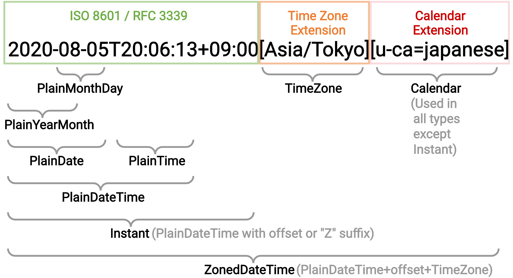

<!-- _class: invert lead -->

# 🕓 Temporal

**Philip Chimento**
Igalia, in partnership with Bloomberg
TC39 March 2021

---

## Update for 2021-03

- Recap
- Summary of changes & delegate reviews
- What is still open
- Discussion
- Stage 3?

---

## ⏳ Why 1½ hours?

- Editors recommended to reserve a generous amount of time in case delegates wanted to get more into the weeds during this plenary
- Hopefully we will not have to use the whole time box

---

## 🕓 Recap: Temporal

- Modern built-in date/time API for JavaScript
- Immutable types
- Nanosecond precision
- Time zone and calendar aware
- Broad group of champions

---

## 🔎 Recap: Where to find...

<style scoped>li a { font-size: 60%; }</style>

- ...the **spec draft**? [tc39.es/proposal-temporal](https://tc39.es/proposal-temporal/)
- ...the MDN-style **API docs**? [tc39.es/proposal-temporal/docs](https://tc39.es/proposal-temporal/docs/)
- ...the **cookbook**? [tc39.es/proposal-temporal/docs/cookbook.html](https://tc39.es/proposal-temporal/docs/cookbook.html)
- ...the **polyfill**? [npmjs.com/package/proposal-temporal](https://www.npmjs.com/package/proposal-temporal)
- ...a quick **JS environment with Temporal**?
  - _open your browser console on the API docs page_

---

## ❄️ Recap: At the last meeting, we...

- Froze the spec text: only made normative changes in response to delegate review
  - Other activity you may have seen: editorial changes, bugfixes, polyfill changes, docs, test262
- Warned you Stage 3 was coming
- Called for reviews

---

<!-- _class: invert lead -->

# Summary of changes
## & delegate reviews

---

## Removal of observable `from()` calls

- Removed the single monkeypatching points that affect deserialization of time zone and calendar IDs
- Background:
  - [proposal-temporal#294](https://github.com/tc39/proposal-temporal/issues/294)
  - [proposal-temporal#1293](https://github.com/tc39/proposal-temporal/issues/1293)


---

## Removal of observable `from()` calls

- Impact: some use cases now require patching all of Temporal
  - Globally adding a new time zone or calendar
  - Replacing builtin time zone data with an updated version
  - Patching a bug in builtin time zone or calendar data
  - Limiting code to only using the ISO calendar or UTC time zone
  - Ensuring cross-browser identical results
- There are other ways to achieve similar results
  - If backwards-compatible, we may for consensus to add one in future


---

## ⛏️ Other minor changes

- From delegate reviews
  - Name changes to clarify ISO vs general operations
  - Improved precision of language re: mutability, time zones
  - Observable property access order on options objects
- Minor bugfixes

---

<!-- _class: invert lead -->

# What is still open?

---

## 🪢 ISO String Extensions

- In January we talked about standardizing extensions to the ISO 8601 string format
- `2020-08-05T20:06:13+09:00[Asia/Tokyo][u-ca=japanese]`
- Bracketed time zone annotation is already a _de facto_ standard
  - But published nowhere
- Bracketed calendar annotation is new

---

## 🪢 ISO String Extensions

- [Internet Draft, "Date and Time on the Internet"](https://ryzokuken.dev/draft-ryzokuken-datetime-extended/documents/rfc-3339.html)
- Presented at IETF 110, working group chartered
- Intended to align with whatever gets standardized
  - No subsequent changes expected, though

---

## 🔢 Intl.NumberFormat

- Names of a small, fixed set of rounding modes in Temporal
  - `roundingMode: 'halfExpand'`, `'ceil'`, `'floor'`, `'trunc'`
- Aligns with Intl.NumberFormat V3 proposal
  - [proposal-intl-numberformat-v3#7](https://github.com/tc39/proposal-intl-numberformat-v3/issues/7)
- Intl.NumberFormat V3 adds more rounding modes than just these four
  - The NumberFormat proposal might seek consensus for adding more modes to Temporal in the future

---

## 📅 Month Code Format

- String format for `monthCode` property
- e.g. `Temporal.now.plainDate('chinese').monthCode === "M03"`
  - `"M05L"` for leap months, etc.
- Shared between Temporal and ICU4X
- No subsequent changes expected

---

## 🛣️ Expectation around parallel standardizations

- We have no reason to expect more changes to the ISO string format, the rounding modes, or the month code format
- Should there be a motivated change in any of these, we expect to come back to committee and ask for the associated change in Temporal


---

<style scoped>li { font-size: 75%; }</style>

## 🗒️ Normative changes proposed by delegates during review

- [#1426](https://github.com/tc39/proposal-temporal/issues/1426) Freeze objects passed in to user code twice?
- [#1427](https://github.com/tc39/proposal-temporal/issues/1427) Use Iterables instead of Lists
- [#1429](https://github.com/tc39/proposal-temporal/issues/1429) Lingering TODOs in Intl

---

<style scoped>li { font-size: 75%; }</style>

## 🗒️ Other editorial changes

- ...that we believe are okay to finish or iterate on during Stage 3
- [#519](https://github.com/tc39/proposal-temporal/issues/519)/[#541](https://github.com/tc39/proposal-temporal/issues/541) Wording ensuring correspondence between Intl and Temporal for time zones and calendars
- [#1244](https://github.com/tc39/proposal-temporal/issues/1244)/[#1249](https://github.com/tc39/proposal-temporal/issues/1249) "Rebase" on ECMA-402 2021 edition
- [#1410](https://github.com/tc39/proposal-temporal/issues/1410) Remove redundant intrinsics definitions
- [#1411](https://github.com/tc39/proposal-temporal/issues/1411) Editorial improvements
- [#1413](https://github.com/tc39/proposal-temporal/issues/1413) Check correct usage of 𝔽 and ∞
- [#1418](https://github.com/tc39/proposal-temporal/issues/1418) Tweak the split between 262 and 402 in the spec text
- [#1424](https://github.com/tc39/proposal-temporal/issues/1424) Editorial improvements
- [#1425](https://github.com/tc39/proposal-temporal/issues/1424) Editorial improvements

---

## 🎛️ Implementer feedback

- We are asking for Stage 3 because we believe implementer and real-world feedback is necessary to proceed
- Based on feedback from implementers, we may ask for consensus to change details
  - e.g. to improve optimizability
  - No change to the surface API unless something is _really_ off

---

## 🐜 We will also fix bugs

- Bugs may come up due to implementer and real-world feedback
- [#1415](https://github.com/tc39/proposal-temporal/issues/1415) Algorithm edge case


---

<!-- _class: invert lead -->

# 🗣 Discussions

---

## Stage 3 criteria

- ✅ The solution is complete, no more work possible without impl. experience, significant usage, external feedback
- ✅ Complete spec text
  - (conditional, on resolution of the previously listed pending issues)
- ❓ Designated reviewers have signed off on the spec text
- ❓ ECMAScript editors have signed off on the spec text


---

<!-- _class: lead -->

# Requesting consensus to move Temporal to Stage 3

---

<!-- _class: invert lead -->

# Thanks!

---

<!-- _class: invert lead -->

# Bonus material

---

<!-- _class: lead -->



---

## Removal of observable `from()` calls

Previously:
```js
const origFrom = Temporal.Calendar.from;
Temporal.Calendar.from = function (calendarLike) {
  if (calendarLike === 'custom-calendar')
    return new MyCustomCalendar();
  return origFrom(calendarLike);
}
Temporal.PlainDate.from('1999-12-31[u-ca=custom-calendar]');
// => Party like it's 1999
```

---

## Removal of observable `from()` calls

- Advantages:
  - 👍 React to **short-notice geopolitical changes** in time zones and calendars, before environments are able to ship updates
  - 👍 **Limit damage** by users making `MyCustomCalendar` available globally
- Disadvantages:
  - 👎 Endorses **monkeypatching** builtin objects
  - 👎 **Early running code** can't defend against late running code

---


---

## Removal of observable `from()` calls

- Advantages:
  - 👍 React to **short-notice geopolitical changes** in time zones and calendars, before environments are able to ship updates
  - 👍 **Limit damage** by users making `MyCustomCalendar` available globally
- Disadvantages:
  - 👎 Endorses **monkeypatching** builtin objects
  - 👎 **Early running code** can't defend against late running code

---

## Removal of observable `from()` calls

- Add a 'resolver' parameter for custom calendar and time zone IDs
- Plan to develop an API and submit a needs-consensus PR for this in the future

---

## Removal of observable `from()` calls

(just an example, not a proposed API)
```js
function calendarResolver(id) {
  if (id === 'custom-calendar')
    return new MyCustomCalendar();
  return Temporal.Calendar.from(id);
}
Temporal.PlainDate.from('1999-12-31[u-ca=custom-calendar]', { calendarResolver });
```

---

## 💿 Calendar and TimeZone Records

- Should a calendar or a time zone Get all its methods at the entry point?
- Store them in a Calendar or TimeZone Record, analogous to PromiseCapability Record
- Unlike PromiseCapability Record, this has implications for user code
- Background: [proposal-temporal#1294](https://github.com/tc39/proposal-temporal/issues/1294)

---

## 💿 Calendar and TimeZone Records

- I've investigated this
- Has some advantages, but also disadvantages
  - 👍 Spec text more concise
  - 👍 Fewer observable Gets in some situations
  - 👎 More observable Gets in other situations
  - 👎 Odd behaviour around mutated prototypes
- Champions have not discussed it yet
- I personally don't think it's an improvement

---

## 💿 Calendar and TimeZone Records

Should these `❔` be 12 or 13 and should any of them be different?

```js
const p = Temporal.now.plainDateTimeISO();
Temporal.Calendar.prototype.monthsInYear = () => 13;

p.monthsInYear  // => ❔
p.calendar.monthsInYear(p)  // => ❔
p.toPlainDate().monthsInYear // => ❔
p.toPlainYearMonth().monthsInYear  // => ❔
```

---

## Month codes

- Some calendars have leap months inserted at different points in the year
- Temporal needs to have two ways to refer to months:
  - in numerical order (`month`, e.g. `3`)
  - stable across years (`monthCode`, e.g. `"M03"`)
- Background: [proposal-temporal#1203](https://github.com/tc39/proposal-temporal/issues/1203)
