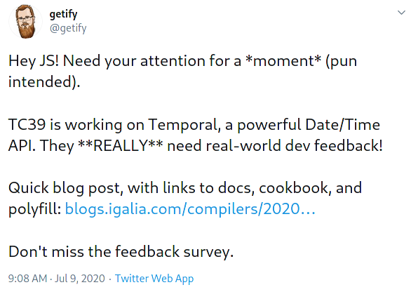

<!--
theme: default
paginate: true
footer: "https://github.com/tc39/proposal-temporal"
-->

# 🕓 Temporal

## Update for 2020-07

- Recap
- Roadmap
- Feedback

<!--
  Introduce self
-->

---

# 🔎 Recap: Where to find...

- ...the **spec draft**? [tc39.es/proposal-temporal](https://tc39.es/proposal-temporal/)
- ...the MDN-style **API docs**? [tc39.es/proposal-temporal/docs](https://tc39.es/proposal-temporal/docs/)
- ...the **cookbook**? [tc39.es/proposal-temporal/docs/cookbook.html](https://tc39.es/proposal-temporal/docs/cookbook.html)
- ...the **polyfill**? [npmjs.com/package/proposal-temporal](https://www.npmjs.com/package/proposal-temporal)
- ...a quick **JS environment with Temporal**?
  - _open your browser console on the API docs page_

<!--
  To refresh your memory, here's an overview with quick links to where everything lives
-->

---

# 🆕 What's new since last time?

- [Announcement](https://blogs.igalia.com/compilers/2020/06/23/dates-and-times-in-javascript/)
- [Survey](https://forms.gle/iL9iZg7Y9LvH41Nv8)

<!--
  Shortly after the previous TC39 plenary we started spreading the word about needing feedback from the developer community.
  Here are links to some of the materials that you can click through to later if you're interested.
-->

---

<!--
  We got some assistance from the developer community as well.
-->

---

# 🗺️ Roadmap

Between now and Stage 3:
- Inform decisions with feedback from people experimenting with the polyfill
- Release an updated polyfill with API improvements based on feedback
- W3C TAG review
- Finalize specification and pass to reviewers by September
- Request Stage 3 in November

<!--
  So now we are right in the middle of the feedback phase.
  By September we aim to have the spec and API frozen, and pass the proposal to the Stage 3 reviewers, leaving a solid 2 months review time as requested before asking for Stage 3.
-->

---

# 📢 Feedback

- Discussions on the proposal's issue tracker
- Survey responses
- More participation than we expected

<!--
  In hindsight, given the amount of participation, it would have been better to send people to a category on es.discourse.group instead of the issue tracker.
  The issue tracker grew by about 30% in a week.
  And, using an issue tracker for feedback gives some people the expectation that you are under obligation to "fix" any ticket they open.
  (But this is only a few people. The vast majority participate in the right spirit and understand that everything is a tradeoff.)
  This is my advice in case you are considering doing the same thing for your proposal!
-->

---

# 📋 Survey

<!--
  Thanks to Yulia and Felienne for inviting us to the research call and discussing how to make the survey more effective.
  It's a mixture of mutiple choice questions that help us see where people are coming from (and weed out the nonsense responses) and free-form questions that are full of insights
-->

---

# 📢 Feedback

- Some valuable insights
- Some rehashes of already-settled discussions
- Sometimes both!

<!--
  Sometimes a rehash of an already-settled discussion turned out to be valuable to re-examine from a new perspective.
-->

---

# 📢 Feedback

- Growing [list of feedback to consider](https://github.com/tc39/proposal-temporal/labels/feedback) before Stage 3
- People really want `Temporal.Duration` to be able to be negative
- We're considering a new type that combines timestamp and time zone
- Sadly, not much response about calendars yet

<!--
  Here is a link to the list of feedback that we have received on the issue tracker.
  The survey is still gathering responses but we'll have that compiled into a consumable form soon.
  We are actively working on addressing the most common complaints that we've gotten.
  We had hoped to receive more feedback from JS developers who need to use non-Gregorian calendars but haven't yet.
  If you know anyone who works with non-Gregorian calendars please send them our way.
  We would actually like to invite them to a meeting.
-->

---

# Thank you

- ❓ Questions?
- 💬 Comments?
