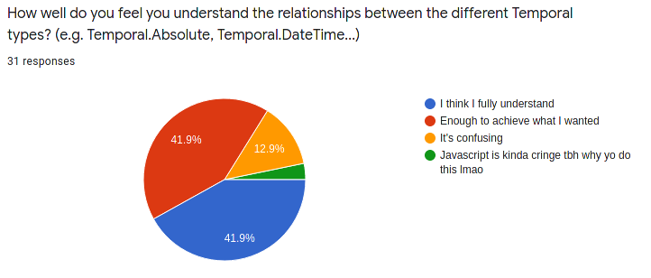

<!--
theme: default
paginate: true
footer: "https://github.com/tc39/proposal-temporal"
-->

# 🕓 Temporal

## Update for 2020-07

- Recap
- Roadmap
- Feedback

<!--
  Introduce self
-->

---

# 🔎 Recap: Where to find...

- ...the **spec draft**? [tc39.es/proposal-temporal](https://tc39.es/proposal-temporal/)
- ...the MDN-style **API docs**? [tc39.es/proposal-temporal/docs](https://tc39.es/proposal-temporal/docs/)
- ...the **cookbook**? [tc39.es/proposal-temporal/docs/cookbook.html](https://tc39.es/proposal-temporal/docs/cookbook.html)
- ...the **polyfill**? [tc39/proposal-temporal](https://github.com/tc39/proposal-temporal/tree/main/polyfill) on GitHub
- ...a quick **JS environment with Temporal**?
  - _open your browser console on the API docs page_

<!--
  To refresh your memory, here's an overview with quick links to where everything lives
-->

---

# 🆕 What's new since last time?

- [Announcement](https://blogs.igalia.com/compilers/2020/06/23/dates-and-times-in-javascript/)
- [Survey](https://forms.gle/iL9iZg7Y9LvH41Nv8)

<!--

-->

---

# 🗺️ Roadmap

Between now and Stage 3:
- Inform decisions with feedback from people experimenting with the polyfill
- Release an updated polyfill with API improvements based on feedback
- W3C TAG review
- Finalize specification and pass to reviewers by September
- Request Stage 3 in November

---

# 📢 Feedback

- Discussions on the proposal's issue tracker
- Survey responses
- More participation than we expected

<!--
  In hindsight, given the amount of participation, it would have been better to send people to es.discourse.group instead of the issue tracker.
  Advice in case you are considering doing the same thing for your proposal!
-->

---

# 📋 Survey

<!--
  Thanks to Yulia and Felienne for the feedback on how to make the survey more effective.
  It's a mixture of mutiple choice questions that help us see where people are coming from (and weed out the nonsense responses) and free-form questions that have are full of insights
-->

---

# 📢 Feedback

- Some valuable insights
- Some rehashes of already-settled discussions
- Sometimes both at the same time!

<!--
  Sometimes a rehash of an already-settled discussion turned out to be valuable to re-examine from a new perspective.
-->

---

# 📢 Feedback

- Growing [list of feedback to consider](https://github.com/tc39/proposal-temporal/labels/feedback) before Stage 3
- People really want `Temporal.Duration` to be able to be negative
- We're considering a new type that combines timestamp and time zone
- Not much response about calendars yet

<!--

-->

---

# Thank you

- ❓ Questions?
- 💬 Comments?

---

---

## 👆 Fingerprinting vectors

- `Temporal.now` — gives access to the current date, time, time zone, and clock precision
- `Temporal.TimeZone.from` — gives access to what time zones are known to the implementation
- `Temporal.Calendar.from` — gives access to what calendars are known to the implementation
